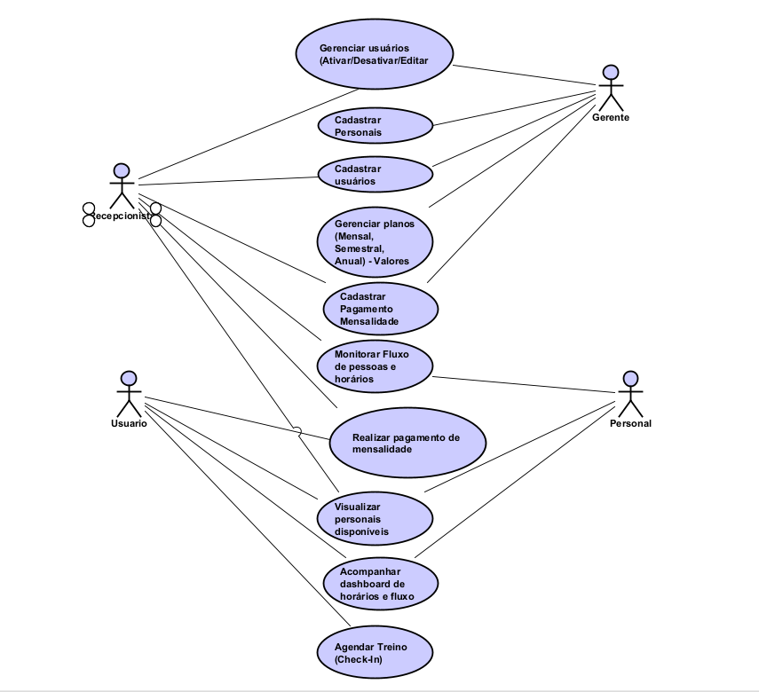
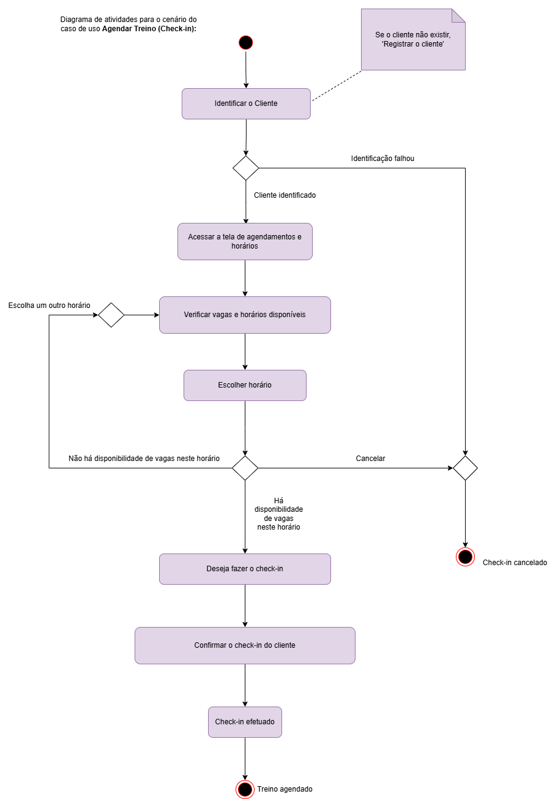

# 🏋️‍♂️ EXERCITY

O **EXERCITY** é uma plataforma fornecida para auxiliar as academias e os usuários visando a otimização de tempo, melhoria na gestão de fluxos e na administração dos proprietários. 📊💪

## 📋 Diagrama de Casos de Uso

## ↪️ Diagrama de Atividades

## 👥 Atores do Sistema
- **Gerente**: Responsável pela administração completa do sistema
- **Recepcionista**: Gerencia o fluxo diário e cadastros básicos
- **Usuário**: Cliente da academia
- **Personal**: Profissional que oferece treinamento personalizado

## 🚀 Funcionalidades Essenciais

### **🔹 Geral**
- ✅ Check-in para cada modalidade
- ⏳ Otimização do tempo na academia
- 🕒 3 horas para uso próprio
- 📅 Gera relatórios semanais de acordo com o fluxo de tempo (usuário e academia)
- ❌ Bloqueio de horário em casos de superlotação
- ⏰ Notificação de tempo restante
- 🏋️ Personais disponíveis no dia e em cada horário

### **💰 Planos para as academias**
- 🏷️ Mensal
- 🏷️ Semestral
- 🏷️ Anual

### **📱 Uso do App**
Disponível para **usuários** e **administradores** da academia.

#### **👤 Usuário (App)**
- 🔑 Login e registro
- 📌 Agendamento de treino
- 💰 Realizar pagamento de mensalidade
- 👀 Visualizar personais disponíveis
- 📊 Acompanhar dashboard de horários e fluxo

#### **👨‍💼 Gerente**
- 👥 Gerenciar usuários (Ativar/Desativar/Editar)
- 🏋️‍♀️ Cadastrar personais
- 📝 Cadastrar usuários
- 💲 Gerenciar planos (Mensal, Semestral, Anual) e seus valores
- 💳 Cadastrar pagamento de mensalidades
- 📈 Monitorar fluxo de pessoas e horários

#### **🧑‍💼 Recepcionista**
- 📝 Cadastrar usuários
- 💳 Cadastrar pagamento de mensalidades
- 📈 Monitorar fluxo de pessoas e horários

#### **🏋️‍♂️ Personal**
- 📈 Monitorar fluxo de pessoas e horários
- 👀 Visualizar outros personais disponíveis (para encaminhamento)
- 📊 Acompanhar dashboard de horários e fluxo

### **📊 Dashboard**
- 📈 Gráfico de horário
- 🔍 Análise do fluxo (picos)
- 📆 Dados dos últimos 7 dias (a cada 3 horas)

## 🎖️ Funcionalidades Não Essenciais
- 🎮 Sistema de gamificação (recompensa por frequência alta)
- 🎨 Design atrativo
- 📞 Suporte direto com administradores de cada academia
- 🏋️ Personalização de treino

## 📌 Status do Projeto
Em desenvolvimento

---

Projeto desenvolvido em grupo, Centro Universitario Una - Modelagem de Software. 🚀🔥
